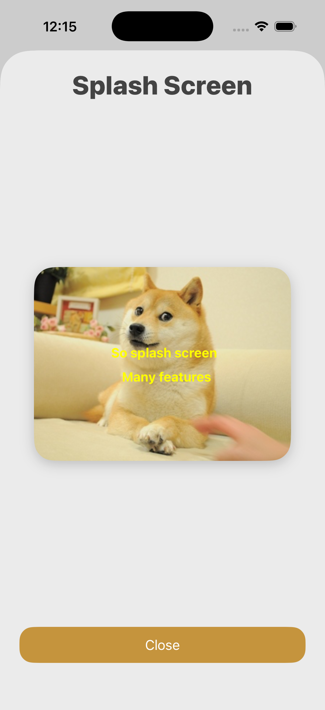
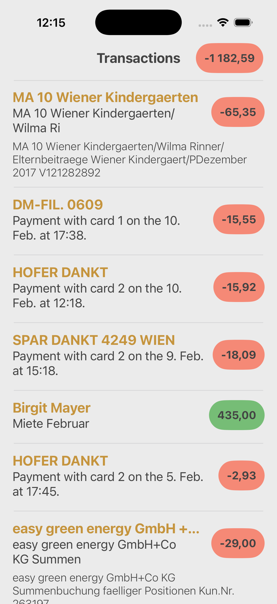
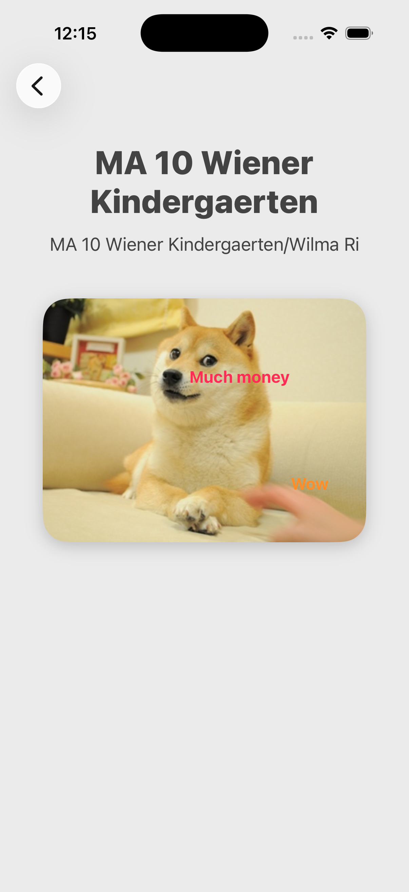

# TrialDay

Find attached an Xcode project which is a starting point for an app displaying transactions.
It contains a mocked API (TransactionsAPI.swift) which returns asynchronously a list of transactions or an error.

Please create an app which implements the following user stories:

- As a user I want to see a tour/splash screen at the first start of the app (just use a blank screen with a close button).
- As a user I want to see a list of transactions.
- As a user I want to be informed if loading of transactions is in progress or failed.
- As a user I want to retry loading of transactions when initial loading failed.
- As a user I want to see the title, subtitle, additionalTexts.lineItems and amount of the transaction in the list of transactions.
- As a user I want to select a transaction and see more details (just display the title and subtitle).
- As a user I want to see the sum of all transactions above the list of transactions.

Choose an approach and app architecture you think of as most suitable for building an app which has to be maintained over a long time by a large team and which will get constantly extended. 
Make sure to add proper and sufficient unit testing.

Feel free to change anything in the current setup/code of the project.

# Architecture

The app uses Clean Architecture combined with MVVM-C on the UI level. Features use the following folder structure:

```
- Feature
    - Data
        - Model
        - Service
        - Repository
        - ...
    - Domain
        - UseCase 
    - View
        - Coordinator
        - ViewController
        - ViewModel
        - ...
```

with the dependencies pointing up, views using domain objects, and domain objects using data. All domain logic should live inside single responsibility UseCase classes. Data objects are wrapping 3rd party services, networking, databases, etc. Object at the same layer can depend on one another. Eg. a UseCase may depend on another UseCase.

On the UI level, coordintors are responsible for handling navigation between scenes. View models prepare data for display, and handle user inputs so View controllers and views can be as simple as possible. 

# Libraries

The project uses SPM to manage dependencies, which there are 3 of.

- Factory: DI framework. All objects should be registered and created through the Factory container. 

- RxSwift: Reactive framework. The app uses RxSwift heavily across the codebase. Most of the functions return an Observable which is further mapped in subsequent layers. 

- SnapKit: UI framework. Eases the creation of UI constraints. 

# Examples

### DI

Each object is registered into the DI container. UseCases use `callAsFunction` for a simpler call site. A single `Observable` stream is preserved across layers. 

```swift
// .../Data/NetworkingService.swift

protocol NetworkingServiceProtocol {
    func data(for url: URL) -> Single<Data>
}

class NetworkingService: NetworkingServiceProtocol {
    func data(for url: URL) -> Single<Data> { ... }
}

extension Container {
    var networkingService: Factory<NetworkingServiceProtocol> {
        self { NetworkingService(...) }
    }
}

// .../Domain/ItemsUseCase.swift

protocol ItemsUseCaseProtocol {
    func callAsFunction() -> Single<[Item]>
}

class ItemsUseCase: ItemsUseCaseProtocol {
    @Injected(\.networkingService) var networkingService

    func callAsFunction() -> Single<[Item]> {
        networkingService.data(for: ...)
            .map { ... }
    }
}

extension Container {
    var itemsUseCase: Factory<ItemsUseCaseProtocol> {
        self { ItemsUseCase(...) }
    }
}

```

### View

A ViewModel depends on UseCases and has up to 4 structs containing `Observable` streams: `InputFromView`, `InputFromCoordinator`, `OutputToView` and `OutputToCoordinator`. The output structures are created as lazy properties and use the input properties.

```swift
class ItemsViewModel {
    struct InputFromView {
        let userClickedOnLoad: Observable<Void>
        let userClickedOnClose: Observable<Void>
    }
    
    struct OutputToView {
        let itemTitles: Single<[String]>
    }

    struct OutputToCoordinator {
        let dismiss: Single<Void>
    }
    
    @Injected(\.itemsUseCase) var itemsUseCase

    let inputFromView: InputFromView

    private(set) lazy var outputToView = OutputToView(
        itemTitles: inputFromView.userClickedOnLoad
            .withUnretained(self)
            .flatMapLatest { $0.0.itemsUseCase() }
            .map { ... }
    )

    private(set) lazy var outputToCoordinator = OutputToCoordinator(
        dismiss: inputFromView.userClickedOnClose.first().map { _ in }
    )
    
    init(inputFromView: InputFromView) {
        self.inputFromView = inputFromView
    }
}
```

### Tests

All components should be written in a testable manner. There's a `Stub` helper class that should be used to mock function calls. Tests can utilize `RxTest` to make use of the test scheduler and virtual timestamps to simulate async operations. 

```swift
func testViewModelLoadsTransactionsOnRetry() {
    let getTransactionsUseCase = MockGetTransactionsUseCase()
    getTransactionsUseCase.stub = Stub { .just(.mock) }
    let viewStateObserver = testScheduler.createObserver(TransactionsViewModel.ViewState.self)
    let retrySignal = PublishSubject<Void>()
        
    Container.shared.getTransactionsUseCase { getTransactionsUseCase }
        
    let sut = TransactionsViewModel(inputFromView: .init(
        userClickedOnTransaction: .never(),
        userClickOnRetry: retrySignal,
        userRefreshed: .never()
    ))
    sut.outputToView.viewState
        .bind(to: viewStateObserver)
        .disposed(by: disposeBag)
    testScheduler.scheduleAt(5) { retrySignal.onNext(()) }
    testScheduler.start()
        
    XCTAssertEqual(viewStateObserver.events, [
        .next(0, .loading),
        .next(0, .transactions(.expectedTransactionsForMock)),
        .next(5, .loading),
        .next(5, .transactions(.expectedTransactionsForMock)),
    ])
}
    
```

# Screenshots

| Splash | Transactions | Detail |
|-|-|-|
|  |  |  |
